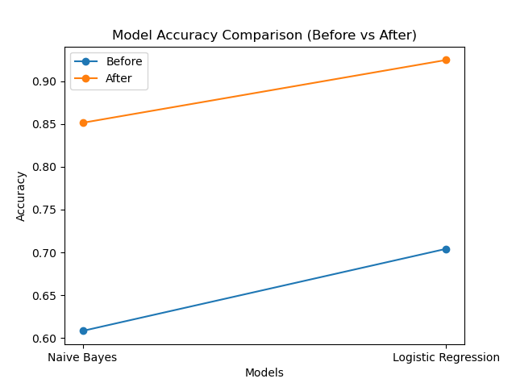
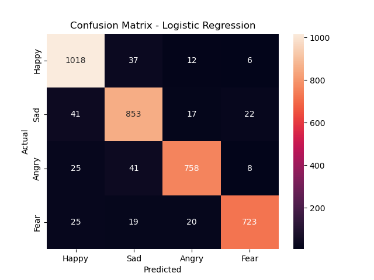

# 🧠 Emotion Classification from Text (Classical ML + Streamlit)

## 📌 Overview
This project builds an **emotion classification system** that predicts emotions from text using **classical machine learning (no deep learning)**.

It combines:
- **TF-IDF features**
- **Lexicon-based features**
- **Naive Bayes & Logistic Regression**

The model is deployed as a **live web application** using Streamlit.

---

## 🌐 Live Demo

👉 **Try the app here:**  
[Emotion Classification from Text](https://emotion-classification-from-text-using-classical-machine-learn.streamlit.app/)

---

## 🎯 Objectives
- Classify text into:
  - 😊 Happy
  - 😢 Sad
  - 😡 Angry
  - 😨 Fear
- Use interpretable machine learning techniques
- Compare multiple ML models
- Improve accuracy using larger datasets
- Build a real-time prediction system

---

## 📊 Dataset Enhancement

- Initial dataset: ~2,000 rows  
- Updated dataset: ~20,000 rows with improved feature distribution  

### Impact:
- Better generalization  
- Reduced overfitting  
- Improved accuracy  
- More stable predictions  

👉 Updating dataset quality and distribution significantly improved model performance.

---

## 📈 Model Performance Comparison

### 🔹 Before Dataset Improvement

| Model                | Accuracy |
|---------------------|----------|
| Naive Bayes         | 0.6084   |
| Logistic Regression | 0.7042   |

---

### 🔹 After Dataset Improvement

| Model                | Accuracy |
|---------------------|----------|
| Naive Bayes         | 0.8513   |
| Logistic Regression | 0.9246   |

---
## 📊 Accuracy Improvement Visualization

This graph shows the improvement in model accuracy after updating the dataset from 2,000 rows to 20,000 rows and feature distribution.  
Significant performance gains can be observed for both models, especially Logistic Regression.

## 📊 Confusion Matrix

The confusion matrix shows how well the model classifies each emotion.  
Diagonal values represent correct predictions, while off-diagonal values indicate misclassifications.

---

## 🧠 Model Explanation

### 🔹 Why Logistic Regression performed better?

- It handles high-dimensional data efficiently  
- Works well with TF-IDF features  
- Captures relationships between features better than Naive Bayes  
- Provides better separation between emotion classes  

### 🔹 Why Naive Bayes performed lower?

- Assumes feature independence (which is not always true in text data)  
- Less effective when features are correlated  

### 🔹 Key Insight

Increasing dataset size significantly improved performance because:
- More data → better generalization  
- Reduced overfitting  
- Improved pattern recognition  

👉 Final model: **Logistic Regression**

---

## 🚀 Improvement Analysis

- Accuracy improved significantly after updating the dataset and feature distribution  
- Naive Bayes improved from **60.84% → 85.13%**  
- Logistic Regression improved from **70.42% → 92.46%**  
- Logistic Regression remains the best-performing model  

👉 This demonstrates the strong impact of data quality and feature improvements on model performance.

---

## ⚙️ Methodology

### 🔹 Data Preprocessing
- Convert text to lowercase  
- Remove special characters  
- Clean text  

### 🔹 Feature Engineering

#### 📊 TF-IDF
- Converts text into numerical form  
- Captures word importance  
- Limited to 3000 features  

#### 📘 Lexicon Features
- Counts emotion-related words  
- Adds human knowledge  
- Improves interpretability  

---

## 🤖 Models Used

### 1️⃣ Naive Bayes
- Simple and fast  
- Suitable for text classification  

### 2️⃣ Logistic Regression (Final Model ✅)
- Better performance  
- Handles complex patterns  
- Higher accuracy  

---

## 🔄 Pipeline
1. Text Cleaning  
2. TF-IDF Extraction  
3. Lexicon Feature Extraction  
4. Feature Combination  
5. Model Training  
6. Prediction  

---

## 🌐 Deployment
The model is deployed using **Streamlit**, enabling:
- Real-time text input  
- Instant emotion prediction  
- Interactive UI  

---

## 💡 Key Features
- Classical ML (No Deep Learning)  
- Model Comparison (NB vs LR)  
- Improved Accuracy with Larger Dataset  
- Real-time Predictions  
- Live Web Application 🌐  

---

## 🗂️ Project Structure
ML Project/

│

├── train_model.ipynb

├── app.py

├── model.pkl

├── tfidf.pkl

├── test.csv

└── README.md

---

## 🛠️ Technologies Used
- Python  
- Scikit-learn  
- Pandas  
- NumPy  
- Streamlit  
- Matplotlib  
- Seaborn  

---

## 🚀 How to Run

### 1️⃣ Install Dependencies
pip install scikit-learn pandas numpy scipy matplotlib seaborn streamlit

### 2️⃣ Train the Model
Run:
train_model.ipynb

This generates:
- model.pkl  
- tfidf.pkl  

### 3️⃣ Run the App
streamlit run app.py

---

## 📸 Example
**Input:**

I am feeling very happy today

**Output:**

😊 Happy

---
## 🧠 Key Insight

This project demonstrates that:

- Data quality matters more than model complexity  
- Even simple models can achieve high accuracy with good features  
- Iterative improvements (dataset + features) significantly boost performance

---

## 🔮 Future Improvements
- Add more emotion categories  
- Try advanced ML/DL models  
- Improve feature engineering  
- Enhance UI/UX  

---

## 🎓 Conclusion

Improving the dataset size and feature distribution led to a significant increase in model performance.

- Logistic Regression achieved the highest accuracy (**92.46%**)  
- Naive Bayes also showed strong improvement (**85.13%**)  
- The project highlights the importance of data quality in machine learning  

👉 Better data → Better model performance

---

## 👩‍💻 Author
**Akanksha Naidu**  
MSc Big Data Analytics  

---

## 📌 License
This project is for academic and learning purposes.
